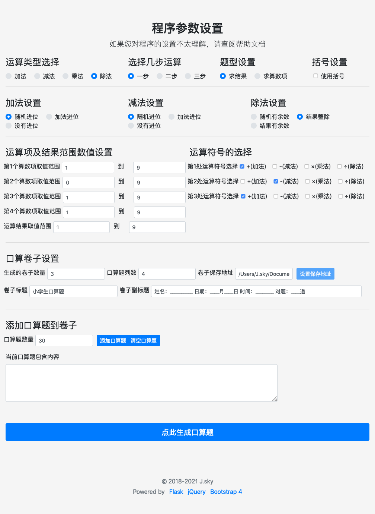

孩子上小学一年级了，加减乘除的口算就要开始练习了，估计老师肯定会让家长出题，所以提前准备一下，利用Python开发了一套自动生成小学生口算题的小应用。而且今天是程序员节，撸200行代码庆祝一下。：）

为了让程序员老爹解放抄题的双手，让你拥有更多的时间去写代码而不用去手写几道口算题而伤神伤脑。所以有没有娃子的程序员爹爹加入一起来继续优化个开源小程序的？有什么点子，发现什么BUG，欢迎留言。

仅以此软件，献给那些热爱`Python`的程序员老爹们！

## 程序核心功能：

1.可以设置各算数项和结果的取值范围及多步算数符号的选择，可以生成求结果、求算数项、带括号的算式，最多支持3步算式题

2.可以简单设置文档标题，小标题。设置生成的口算题文档个数

3. web或终端下一键生成口算题（dev版本中正在调试开发中）

## 程序的安装

1. Git克隆或是下载压缩包。本程序运行调试的python环境为`3.8.8`,建议新建一个全新的虚拟环境来测试。

下载程序进入程序主目录，安装程序相关依赖，在程序根目录下运行终端：

    pip install -r requirements.txt

2. 程序主目录终端下运行`flask run`

3. 修改运算项和结果范围里的数值,多步运算请添加修改需要的运算等参数

4. 添加口算题到列表中，然后生成口算题,生成的口算题文件都在docx文件目录下，打开后连接打印机就可以开印了。

**最近发现有些朋友下载代码后不能使用请看这里**

1、本程序运行调试的python环境为`3.8.8`,建议新建一个全新的虚拟环境来测试。
2、如果运行调试中发现某些模块运行异常或是报错，请参照下边的模块版本更新对照一下，可能是某个模块版本过高造成的。
3、如果依然无法运行，可以发起issues提供详细的报错信息，我们一起分析。
    
    pip list
    Package       Version
    ------------- -------------------
    autopep8      1.5.7
    certifi       2020.12.5
    click         7.1.2
    Flask         1.1.2
    itsdangerous  1.1.0
    Jinja2        2.11.3
    lxml          4.6.3
    MarkupSafe    1.1.1
    pip           21.0.1
    pycodestyle   2.7.0
    python-docx   0.8.10
    python-dotenv 0.17.1
    setuptools    52.0.0.post20210125
    toml          0.10.2
    Werkzeug      1.0.1
    wheel         0.36.2

## 终端下快速生成预制口算卷子

进入程序目录后终端下：

具体请查看帮助 `flask go --help`

    (flask_psm) -bash-3.2$ flask go --help
    Usage: flask go [OPTIONS]
    
      命令行快速创建并生成口算题卷子
    
    Options:
      --id TEXT      口算题标识，根据标识可以快速生成口算题卷子
      --q INTEGER    需要打印的卷子数量
      --row INTEGER  口算卷子题的列数
      --tit TEXT     口算题卷子标题设置
      --st TEXT      口算题标卷子副标题
      --help         Show this message and exit.

## 程序界面截图：

## 程序成生的口算题截图：

## 程序的架构
前端：bootstrap4 jQuery
后端：Flask python-docx 等框架

## 一些想法
重构程序界面的时候发现自己很笨，所以GUI的处理很让人头疼，希望有时间的程序员来贡献一些代码，共同完善这个小程序，为更多的程序员老爹省下更多的时间！

目前对前端的界面不是很满意，希望有空的同学可以帮忙重新设计一下前端的界面。

后端主要是一些简单的算法，后续还想添加的功能有：小数的口算题，整十百千的口算，分数口算题（这个完全没有思路）。

最后感谢曾经贡献过代码的同学，再次谢谢你们！

## 捐赠

开发和维护 PrimarySchoolMathematics 花费了我很多业余时间，如果你觉得项目帮助到您，请认真考虑请作者喝一杯咖啡好吗？😋

 

