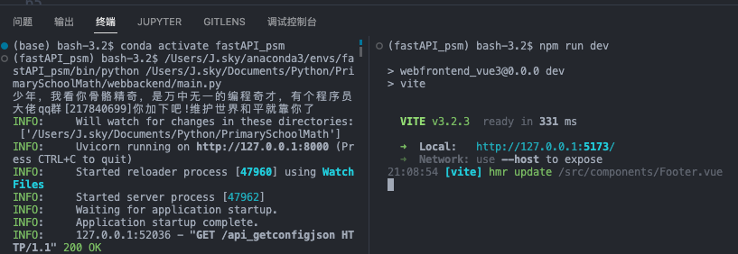
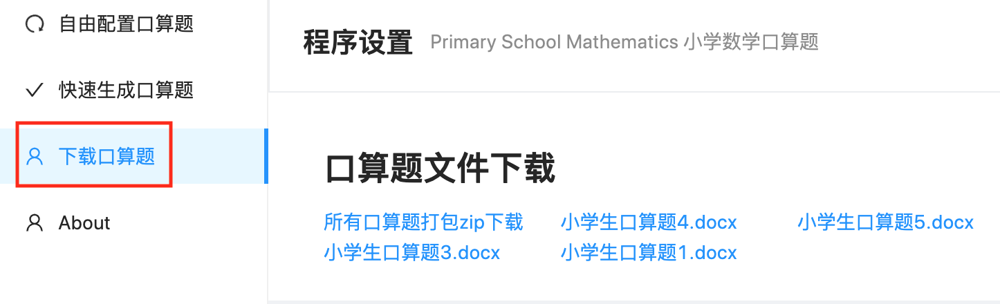
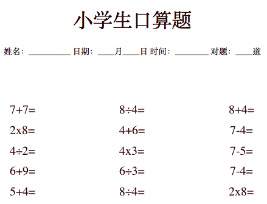
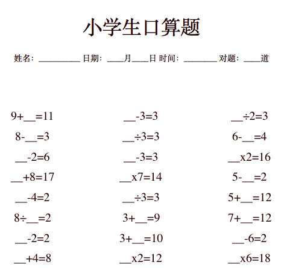
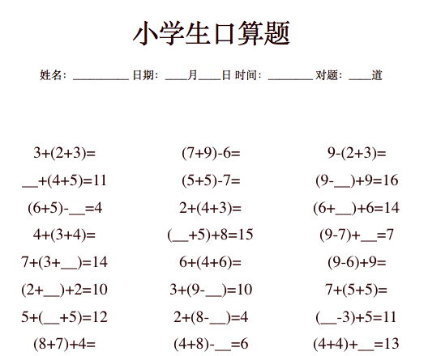
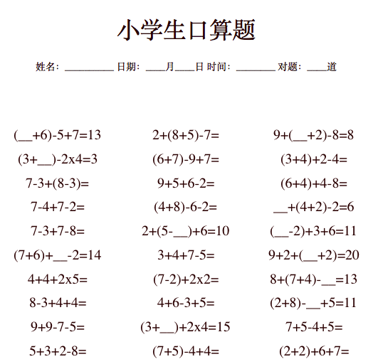

#  Primary School Mathematics 小学数学口算题


孩子上小学一年级了，加减乘除的口算就要开始练习了，估计老师肯定会让家长出题，所以提前准备一下，利用Python开发了一套自动生成小学生口算题的小应用。
为了让辛苦的程序员老爹解放抄题的双手，本程序让你拥有更多的时间去写代码而不用去手写几道口算题而劳神伤脑。所以有或没有娃子的程序员老爹们一起来继续优化个开源小程序的？有什么点子，发现什么BUG，欢迎提出issue。

仅以此软件，献给那些热爱`Python`的程序员老爹们！

## 程序更新

2022-11-13 更换了前端框架为vue3,后续将更新一些新功能.比如一键生成预制的常见类型的口算题,口算题小游戏等.

2022-11-05 由于之前代码所用的框架是比较久远的版本,很多新人需要折腾很长时间才能运行起来,鉴于此种情况,全面更换了前后端的框架,使程序的运行环境搭建更为方便了.重构期间修复了一些bug和逻辑.

## 程序核心功能：

1.可以设置各算数项和结果的取值范围及多步算数符号的选择，可以生成求结果、求算数项、带括号的算式，最多支持3步算式题,除法可以生成带有余数的口算题.

2.可以简单设置文档标题，小标题。设置生成的口算题文档个数

3.一键生成常见类型口算题和口算题小游戏（正在调试开发中）

## 程序的安装

Git克隆或是下载压缩包。

`git clone https://gitee.com/J_Sky/PrimarySchoolMathematics.git`

## 后端的环境搭建

1. 本程序开发调试的python环境为`3.8.13`,建议新建一个全新的虚拟环境来测试。

下载程序进入`/webbackend`，安装程序相关依赖，在程序根目录下运行终端：

    cd webbackend
    pip install -r requirements.txt

如果pip更新依赖缓慢,请使用下边的代码试试:
    pip install -r requirements.txt -i http://pypi.douban.com/simple

2. `/webbackend`目录终端下运行`python main.py`,或者使用`vscode`打开`/webbackend/main.py`,运行当前文件即可.
3. 打开浏览器在地址栏中输入`http://127.0.0.1:8000/docs`,看到下图就是环境搭建成功了.


## 前端环境搭建

1.  进入`./vue3_webfrontend` 终端输入: `cd vue3_webfrontend`,如果你使用的是vscode,可以使用分屏新建终端,这样前后端的服务器启动可以一目了然.


2. 终端输入:`npm install`更新下载前端的依赖,如果速度太慢,建议临时使用镜像服务器下载依赖:`npm install --registry https://registry.npm.taobao.org`.
3. 终端输入:`npm run dev` 启动前端服务器.正常的话打开网址`http://127.0.0.1:5173/`你会看到下图:
   


**最近发现有些朋友下载代码后不能使用请看这里**

1. 本程序运行调试的python环境为`3.8.X`,建议新建一个全新的虚拟环境来测试。
2. 首次运行时,前后端报错的话,大概率都是依赖没有安装,建议查看错误提示安装相关依。
3. 如果依然无法运行，可以发起issues提供详细的报错信息，或是联系我一起分析。

## 使用教程

#### 启动程序

终端下进入程序根目录,先启动后端:

```
(fastAPI_psm) bash-3.2$ cd webbackend
(fastAPI_psm) bash-3.2$ python main.py
```

终端显示下图即是后端启动完毕.


再开一个终端,如果是`vscode`拆分终端,进入到`./vue3_webfrontend`,输入`npm ruv dev` 终端显示如下就说明启动成功了.


### 程序的使用

1. 例:生成10以内加法口算题60道,设置好算数项的取值范围和运算符号,设置好口算题数目之后点添加口算题,最后点击生成口算题即可!


2. 口算题卷子保存在`./docx`目录下,用软件打开后连接打印机就可以打印了.
页面上也有提供下载的连接,方便远程下载.


3. 一些复杂的口算题都是先从添加口算题开始,比如我要打印60道100以内的加减法混合口算题,结果不大于70.
这个时候我们可以选择第一步运算符号的加法和减法,设置好其他参数,然后添加口算题,最后点生成口算题.
4. 具体的使用可以多试试,其实很简单啦!


## 程序成生的口算题截图：






## 一些想法
重构程序界面的时候发现自己的能力有限，所以界面ui的处理很让人头疼，希望有时间有能力的前端后端全栈的牛逼大佬来贡献一沓代码，共同完善这个小程序，为更多宝贝的程序员老爹老妈省下更多的时间！后端主要是一些简单的算法，后续还想添加的功能有：小数的口算题，整十百千的口算，分数口算题（这个完全没有思路）。

最后感谢曾经贡献过代码的同学，再次谢谢你们！

## 捐赠

开发和维护 PrimarySchoolMathematics 花费了我很多业余时间，如果你觉得项目帮助到您，请认真考虑请作者喝一杯咖啡好吗？😋


