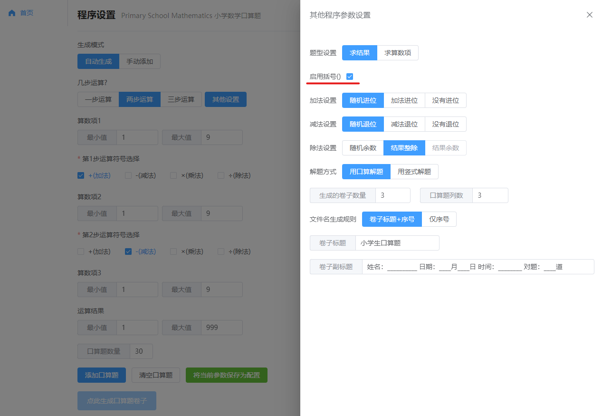

#  小学数学口算题 | Primary School Mathematics 2.0


## 背景 | Background
孩子上小学一年级了，加减乘除的口算就要开始练习了，估计老师肯定会让家长出题，所以提前准备一下，利用Python开发了一套自动生成小学生口算题的小应用。
为了让辛苦的程序员老爹解放抄题的双手，本程序让你拥有更多的时间去写代码而不用去手写几道口算题而劳神伤脑。所以有或没有娃子的程序员老爹们一起来继续优化个开源小程序的？有什么点子，发现什么BUG，欢迎提出issue。

仅以此软件，献给那些热爱编程的程序员老爹们！

**直接使用地址**: [临时地址](http://paper.moteng.ltd:1101)(随时可能无法访问)

## 功能列表 | Features
- 可以设置各算数项和结果的取值范围及多步算数（最多三步）符号的选择。
- 可以生成求结果、求算数项、带括号的算式，除法可以生成带有余数的口算题。
- 可以简单设置试卷标题，副标题。设置生成的口算题试卷个数。
- 用户可最多保存10份配置在浏览器端，方便给熊孩子重复生成口算题。🔥
- 除口算解题外还提供生成竖式题，让熊孩子不能逃脱被试卷支配的恐惧。🔥
- 除了自动生成试题外，还支持手动添加题目，可以手工添加特殊题目，还可以将之前的错题进行重复练习。🔥
- 提供仅用序号来作为生成的文件名，让家长们蹭公司打印机时更隐蔽。🔥

## 如何使用 | How to use

### 例子 | Samples

例1：生成10以内的加减法


例2：2位数乘以2位数的竖式题


例3：2位数除以1位数并且有余数


例4：不带括号的混合运算


例5：带括号的混合运算


## 本地运行 | Getting Started
前往后端目录

```bash
  cd webbackend
```

安装依赖

```bash
  # Python version >= 3.8.X

  pip install -r requirements.txt

  # 如果更新依赖缓慢,请使用下边的代码试试:
  pip install -r requirements.txt -i http://pypi.douban.com/simple
```

启动

```bash
  python main.py
```

打开浏览器在地址栏中输入`http://127.0.0.1:1101/test`,看到显示`当前环境为:未配置`就表示启动成功了。

前往前端目录

```bash
  cd vue3_webfrontend
```

安装依赖

```bash
  # NPM
  npm install

  # Yarn(推荐)
  yarn
```

启动

```bash
  # NPM
  npm run start

  # Yarn
  yarn dev
```

启动成功后访问`http://127.0.0.1:1102`即可。

**最近发现有些朋友下载代码后不能使用请看这里**

1. 本程序运行调试的python环境为`3.8.X`,建议新建一个全新的虚拟环境来测试。
2. 首次运行时,前后端报错的话,大概率都是依赖没有安装,建议查看错误提示安装相关依赖。
3. 如果依然无法运行，可以发起issues提供详细的报错信息，或是联系我一起分析。

## 如何部署 | How to deploy
项目默认提供了docker的部署方式

构建镜像
```shell
docker build -t primary-school-mathematics .
```

启动服务
```shell
docker run -d --name=PrimarySchoolMathematics -p 1101:1101 primary-school-mathematics
```

## 技术栈 | Tech Stack
- Vue3
- element-plus
- Python 3.8
- FastAPI

## 贡献者 | Contributors
感谢曾经贡献过代码的同学，再次谢谢你们！
- [@J_sky](https://github.com/bosichong)
- [@KK++](https://github.com/tsukasa521)
- [@ruancheng77](https://github.com/ruancheng77)
- [@andywu1998](https://github.com/andywu1998)

后续还想添加的功能有：小数的口算题，整十百千的口算，分数口算题（这个完全没有思路）。

## 捐赠

开发和维护花费了我很多业余时间，如果你觉得项目帮助到您，请认真考虑请作者喝一杯咖啡好吗？😋

 


